# DeclaratorLM

### 🔍 Making public declarations actually useful. Because open data deserves better tools.

**What this is.** In Ukraine, officials, MPs, judges, and other public figures file electronic asset declarations with [NAZK](https://public.nazk.gov.ua/public_api) every year — official reports of their wealth, income, and their family's property. These declarations are public. DeclaratorLM takes such a declaration, cleans it, and runs it through AI that looks for signs of corruption: wealth that doesn't match income, assets held by third parties, suspicious patterns. The output is a risk score, concrete findings with evidence, and a link back to the primary source. Built for journalists, anti-corruption researchers, and civic-tech developers who need to triage more declarations than anyone could read by hand. Locally on your own machine, or through cloud models — your choice.

> 📌 **First, the essentials: scope and the tool's role.**
> - **The specialization is narrow and deliberate.** The tool is tailored to the **Ukrainian context**: the data format, the way declaration sections are parsed, family-relation resolution, the prompts — all of it is tied to the structure of NAZK's open API. It is not a universal "declarations analyzer" — it works specifically with the NAZK register (Ukraine). To use it on another country's declarations you'd have to adapt it, and the code is open for exactly that.
> - **It's a powerful analytical tool — but a tool.** DeclaratorLM does the heavy lifting: it cleans, structures, analyzes, builds reports, and shows you **where to look**. The final assessments, conclusions, and decisions stay with a human — as they should (see [Legal and ethical boundaries](#legal-boundaries)).

<p align="center">
  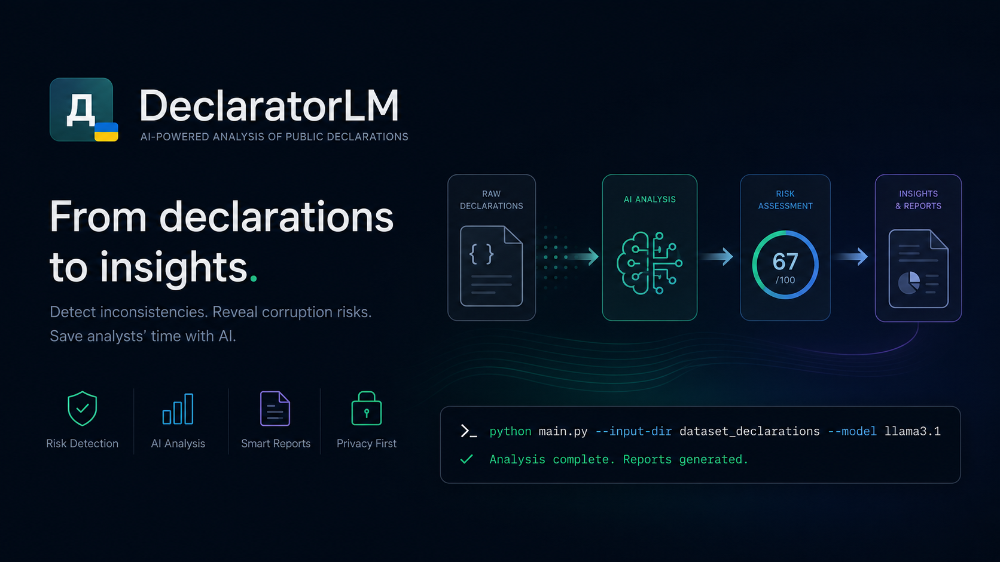
</p>

<p align="center">
  📖 <b><a href="README.uk.md">Українська версія / Ukrainian version →</a></b>
</p>

---

## 🧨 The problem

In Ukraine, officials' asset declarations have been public and digital since 2016. That sounds like a dream for holding power accountable. In practice:

- 📈 **There are millions of declarations.** Hundreds of thousands of people file them every year, and the archive only grows.
- 👥 **Only hundreds of people actually read them.** Thousands at best. Journalists, analysts, activists, investigators. A single person physically cannot hand-process dozens of pages of numbers — and there are millions of such declarations.
- 🗃️ **The data is "dirty."** The NAZK API returns each declaration as a large, technical, hard-to-read JSON: internal codes, service fields, `[Confidential information]` placeholders, people referenced by numeric ids. Just to figure out who owns an apartment, you have to cross-reference tables by hand.

> **In short:** the open data exists, but much of it goes unused. It's hard to read manually at scale, and the format scares off even the people who would want to.

**DeclaratorLM takes on both problems.** It *automatically* cleans the technical JSON down to its human-readable essence **and** hands it to an AI that produces a first draft of the analysis — with cleanup, structuring, charts, and finished reports.

It runs **in batches and automatically** — download, cleanup, analysis, reports — with a queue, pause, and resume-after-interruption. How much you get through in one go depends on your resources (models, time, cloud budget), not on artificial limits in the tool. In practice you point it at a focused set — a body, a region, a year — and an analyst gets through it noticeably faster than by hand. The machine suggests where to look; the human decides what to do about it.

---

## ⚙️ How it works

One simple pipeline — from a raw file to a finished conclusion:

**📥 Declaration  →  🧹 Compact v2  →  🤖 AI  →  📊 Report**

| 📥 Declaration | 🧹 Compact v2 | 🤖 AI | 📊 Report |
|----------------|---------------|-------|-----------|
| JSON from NAZK, ~11,000 chars of "dirty" text | clean, ~3,000 chars (−74%) — essence only | looks for risks, anomalies, hidden links | HTML + CSV, charts, summary |
| *what the official filed* | *noise removed, names instead of ids* | *risk score 0–100, findings with evidence* | *filters, search, links back to NAZK* |

1. **📥 Download.** You give the program a folder of declarations, or pull them straight from the [NAZK API](https://public.nazk.gov.ua/public_api) by a person's name or ID.
2. **🧹 Cleanup (compact v2).** The program discards technical noise, decodes internal codes, and turns "owner = person #2" into "spouse: Maria Ivanenko." The declaration becomes **three times shorter**, while its content stays intact (and there's a "Detailed" mode as a safety net — see below).
3. **🤖 Analysis.** The compacted declaration goes to a model (local or cloud) that compares income against assets and looks for signs of corruption.
4. **📊 Report.** The result is an interactive HTML table, CSV, and — in dossier mode — year-by-year trend charts.

---

## 🌐 Porting to other countries

DeclaratorLM is built for Ukraine's NAZK, but the approach is universal: in almost every country a declaration has the same essence — property, family, income, accounts, business, debts. The main barrier to adaptation is **not the schema, but the data format**: from ready-made JSON to scanned paper.

The adapter idea is simple: write one module per country that converts its data into the internal `compact v2` format — and then all the analysis, prompts, and reports work **with no changes at all**.

| Country | Data format | Adaptation effort |
|---------|-------------|:---:|
| 🇺🇦 Ukraine | JSON via API | ✅ already supported |
| 🇫🇷 France | XML (open data) | ⭐ low |
| 🇬🇪 Georgia | HTML / OpenSanctions | ⭐⭐ |
| 🇲🇩 Moldova | HTML / OpenSanctions | ⭐⭐ |
| 🇨🇱 Chile | online disclosure | ⭐⭐ |
| 🇷🇴 Romania | PDF form | ⭐⭐⭐ |
| 🇺🇸 USA | PDF (OGE 278e) | ⭐⭐⭐ |
| most countries | scans / not public | 🔴 unsuitable |

A detailed breakdown of the most suitable countries, the unsuitable cases, and adaptation paths (including a "bulk" route via OpenSanctions / FollowTheMoney data) is in **[PORTING.md](PORTING.md)**.

---

## 🎯 What exactly gets analyzed

The model doesn't just "read text" — it cross-references concrete things and looks for concrete red flags:

| What's compared | What the AI looks for |
|-----------------|----------------------|
| 💰 **Income ↔ assets** | Whether the standard of living matches the official salary |
| 🏠 **Real estate and land** | Property with no stated value, undervaluation, suspiciously cheap deals |
| 🚗 **Vehicles** | Premium-class cars, especially registered to other people |
| 💵 **Cash and accounts** | Cash/account balances disproportionate to declared income |
| 🏦 **Banks and institutions** | Where accounts are held, and in whose name |
| 🏢 **Corporate rights** | Business ties, beneficial ownership, conflicts of interest |
| 👨‍👩‍👧 **Family assets** | Property "signed over" to family members or third parties |
| 📅 **Significant changes** | Many large transactions in a short period, purchases with no source of funds |

For each declaration you get:

- 🔢 a **risk score 0–100** and a risk level (low / medium / high / critical);
- 🚩 **findings** — concrete suspicions, each with evidence, names, and amounts;
- 🧾 **red flags** and a list of **what needs manual verification**;
- ✅ **agreed facts** — what, conversely, looks normal and why;
- 📝 a **final assessment** — a short summary in plain language.

> ⚠️ **Important, and not in fine print:**
> - 🔍 This is "a magnifying glass, not a verdict." The program shows **where to look** — the human always makes the call.
> - 🕳️ **A low score ≠ "clean."** The model can *miss* what's hidden. A low risk means only "the AI didn't spot anything obvious here," not "this person is definitely honest." False reassurance is as dangerous as false suspicion.
> - 🧠 **The quality of the result depends directly on the chosen model** (see [Which model to use](#which-model) below). A weak model means weak, sometimes wrong analysis — and that's a limitation of the *model*, not of the data or the tool.
> - 🚫 The model is explicitly forbidden from inventing facts and must rely only on the declaration's data — but, like any AI, it still gets things wrong sometimes.

---

<a id="legal-boundaries"></a>

## ⚖️ Legal and ethical boundaries

This is the most important section. DeclaratorLM does **not** decide who is corrupt, and it accuses **no one** of anything. It is built as a **demonstrational, analytical tool** and makes no decisions of its own. Here is why that boundary is drawn deliberately — and what it rests on.

> The legal citations below are to Ukrainian law, since that is the jurisdiction of the data (NAZK declarations). The reasoning is what governs how the tool may be used.

### ✅ Why analyzing this data is legal

- **The data is already public by law.** Article 47 of Ukraine's [Law on Prevention of Corruption](https://zakon.rada.gov.ua/laws/show/1700-18) (No. 1700-VII) explicitly establishes that the Unified State Register of Declarations is **open**, available 24/7, and provided in a machine-readable format **specifically for reuse** (automated processing). In other words, automated analysis of declarations is not a workaround — it's a use case the law itself anticipates.
- **The right to work with information.** Article 34 of the [Constitution of Ukraine](https://zakon.rada.gov.ua/laws/show/254%D0%BA/96-%D0%B2%D1%80) guarantees everyone the right to **freely collect, store, use, and disseminate information**.
- **Privacy is respected — and it's baked into the code.** That same Article 47 restricts access to sensitive fields: tax ID number, passport, place of residence, date of birth, the exact location of objects. The public declarations already come **without that data**, and the `compact v2` cleanup step additionally discards leftover service identifiers before the declaration ever reaches the model.

> 🔁 **This absence of precise data is a double-edged sword — and both edges deserve to be named honestly:**
> - ➕ **The upside (privacy and safety).** The model physically sees nothing sensitive. Even if a cloud provider caches your request, there are no addresses, no passports, no dates of birth in it. There's simply nothing sensitive to "leak."
> - ➖ **The downside (verifiability).** Without a precise address or identifiers, you **cannot automatically cross-check** an object against external registries (e.g. the same apartment by address in the State Register of Property Rights). The line is drawn on the side of privacy — that's a deliberate legal trade-off, not a flaw in the tool.

### 🚫 Why the output is NOT a verdict

- **Presumption of innocence.** Article 62 of the [Constitution of Ukraine](https://zakon.rada.gov.ua/laws/show/254%D0%BA/96-%D0%B2%D1%80): a person is presumed innocent until their guilt is proven **in a lawful manner and established by a court's guilty verdict**. An accusation **cannot be based on assumptions**, and all doubts are resolved in the person's favor. The program's risk score is an assumption and a hypothesis — not proof of guilt.
- **It's a "value judgment," not a fact.** Article 30 of Ukraine's [Law on Information](https://zakon.rada.gov.ua/laws/show/2657-12) (No. 2657-XII) distinguishes **statements of fact** from **value judgments** — the latter are not subject to proof of their truthfulness. DeclaratorLM's findings are, by their nature, value judgments and "worth-a-look" pointers, not assertions of fact about anyone's guilt.
- **Official verification is not our competence.** Article 50 of Law No. 1700-VII assigns **the full verification of declarations** (accuracy of the data, correctness of asset valuations, signs of illicit enrichment) exclusively to **NAZK**. Establishing guilt is for the courts. A private tool cannot and does not do this — it merely helps a human decide which declarations are worth passing to those who do have the authority.

### 🔬 Transparency as the safeguard

The core ethical guarantee is that the system is **not a "black box."** Every finding and every score rests on concrete data from the declaration, with a link to the primary source on public.nazk.gov.ua. And **DEBUG audit mode** preserves the **entire processing chain** (raw declaration → compact → the request to the model → the response → the normalized result), so any conclusion can be **reproduced and examined** rather than taken on faith. This is the opposite of "the AI said so, therefore guilty."

> 📌 The boundary in one line: **the data is public → analysis is allowed; the output is a hypothesis and a value judgment → it accuses no one; official decisions belong to NAZK and the courts.**
>
> *This section reflects the project's good-faith legal position, not legal advice. Use of the tool is the user's own responsibility, in compliance with Ukrainian law and the ethical norms of journalism and research.*

---

## 🖼️ What it looks like

**📈 Usage dashboard** — what you see when nothing is running: how many declarations have been processed, the risk-level breakdown, time saved, and the most common finding types:

<p align="center">
  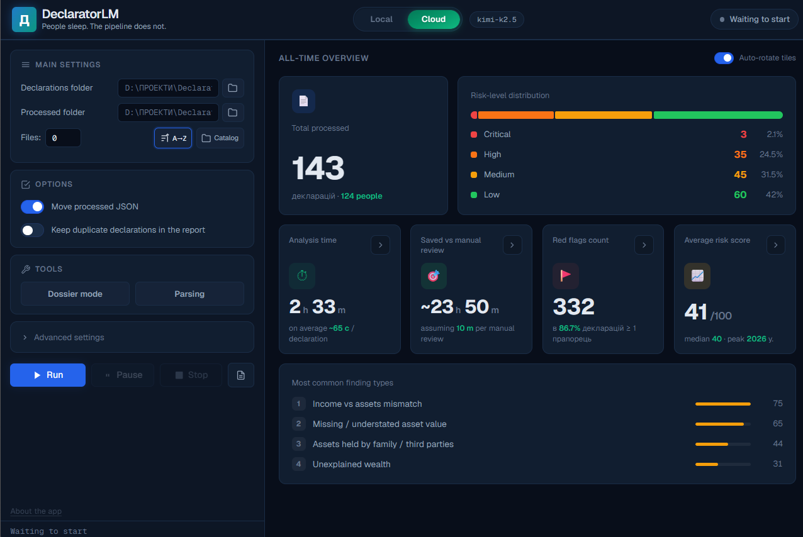
</p>

<table>
<tr>
<td width="50%">

**☁️ Cloud provider settings**
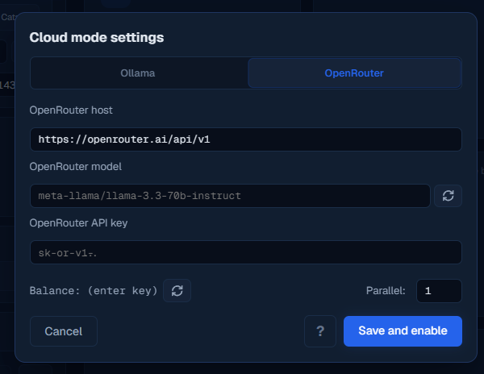

</td>
<td width="50%">

**🗂️ Declaration catalog**
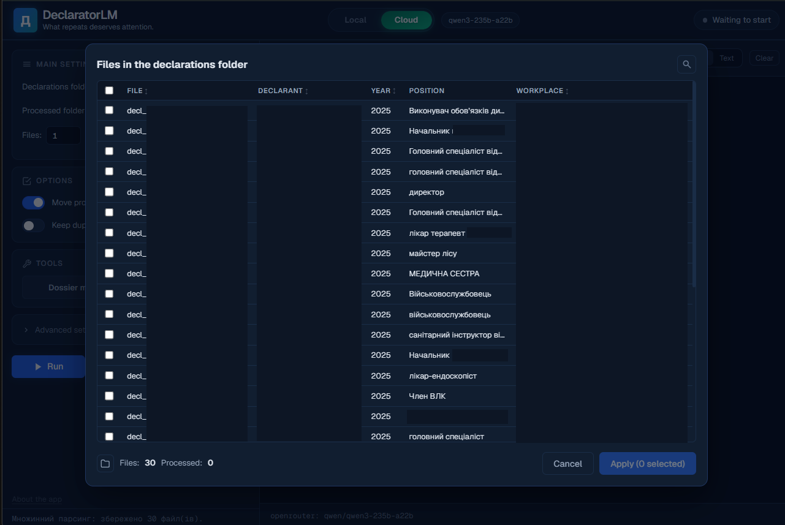

</td>
</tr>
<tr>
<td width="50%">

**🔎 Searching the catalog**
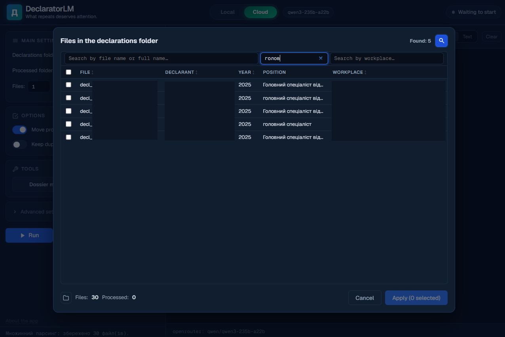

</td>
<td width="50%">

**📥 Downloading one declaration from NAZK**
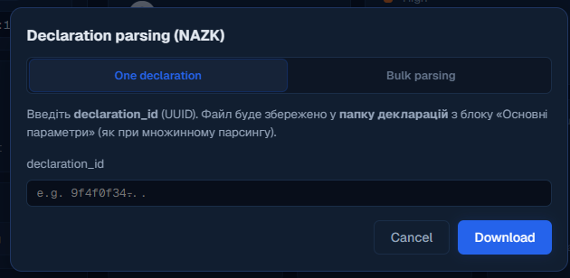

</td>
</tr>
<tr>
<td width="50%">

**📦 Bulk-downloading from NAZK**
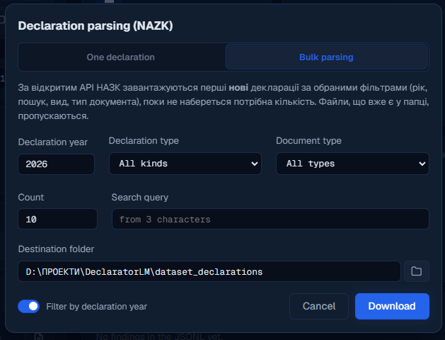

</td>
<td width="50%">

**⏳ Live processing log**
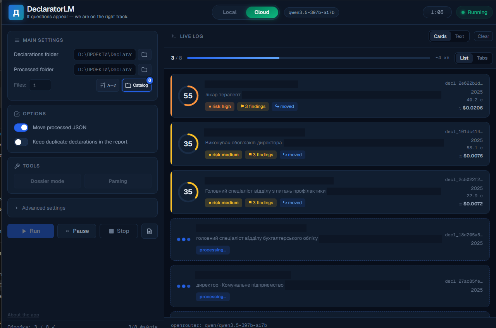

</td>
</tr>
</table>

<p align="center">
  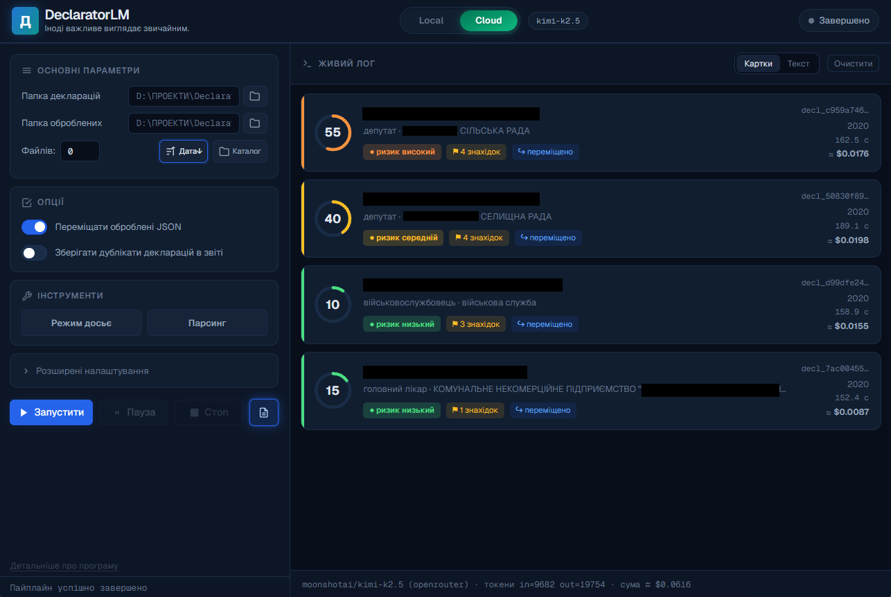
  <br><sub>✅ A completed batch: risk score, finding count, cost, and tokens per declaration.</sub>
</p>

**📊 Interactive HTML report** — filter by risk, position, model; expand the full analysis per declarant; findings with evidence; family-assets overview; a clickable link to the original filing on public.nazk.gov.ua:

<p align="center">
  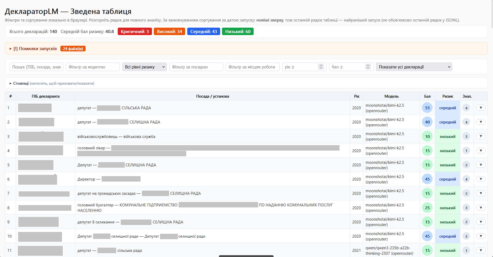
</p>
<p align="center">
  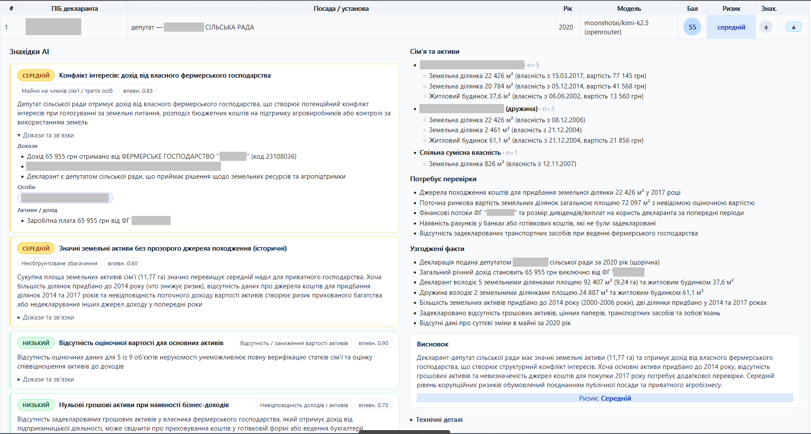
  <br><sub>An expanded row: findings with evidence, family assets, what to verify, and the final assessment.</sub>
</p>
<p align="center">
  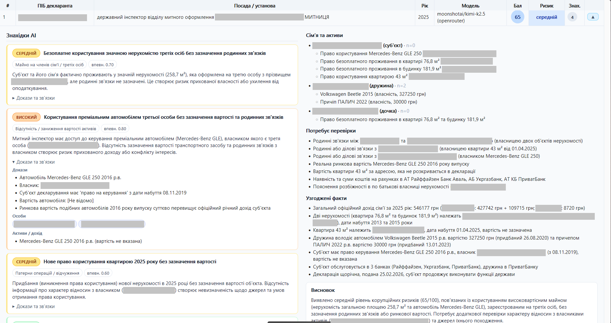
  <br><sub>Same report, a different declarant — the risk card adapts to the specific findings.</sub>
</p>

**🕵️ "Dossier" mode (Deep Research)** — download every declaration a single person ever filed, straight from the API, or pick a local folder of already-downloaded ones:

<table>
<tr>
<td width="50%">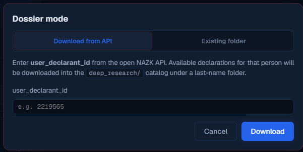</td>
<td width="50%">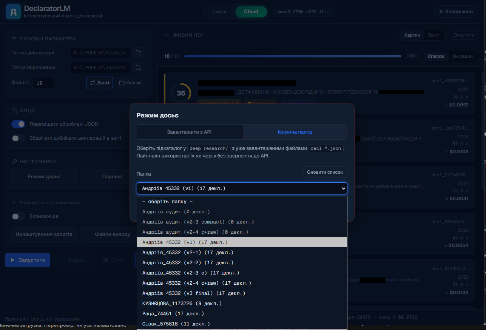</td>
</tr>
</table>

While it's processing, the interface switches to a red accent and shows a live dossier view — the declarant currently being analyzed, with charts that update as results come in:

<p align="center">
  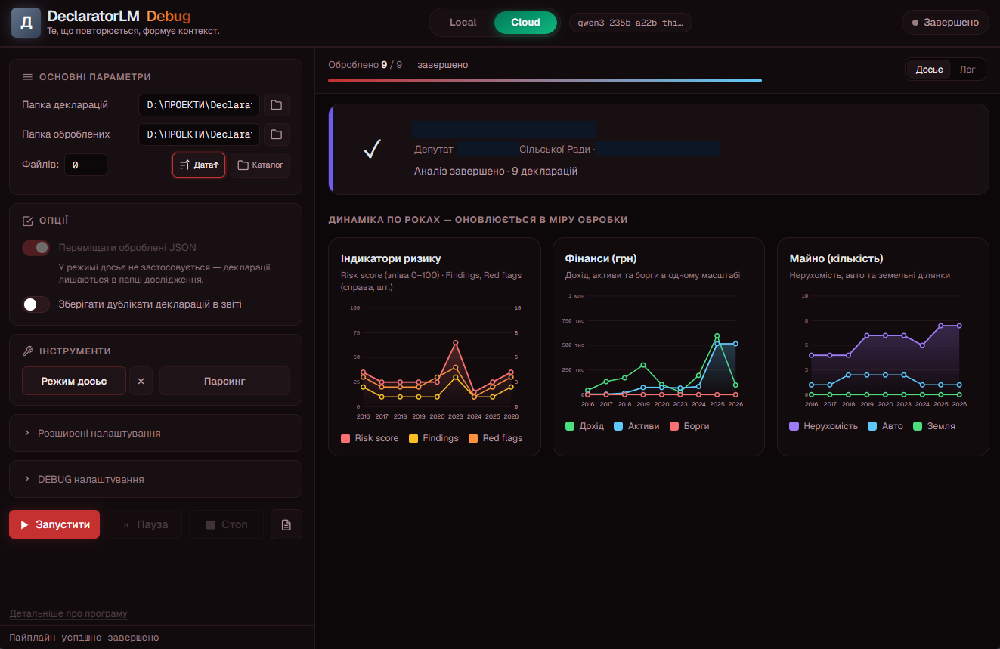
</p>

The result is a report with every declaration that person filed, laid out chronologically:

<p align="center">
  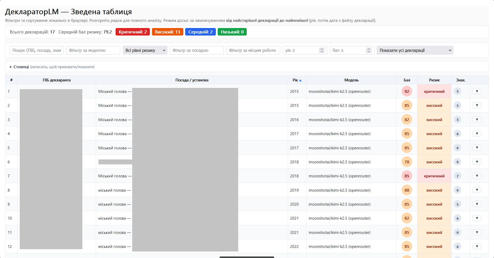
</p>

...plus year-by-year charts of risk, finances, and assets, and an LLM summary of the whole dossier:

<p align="center">
  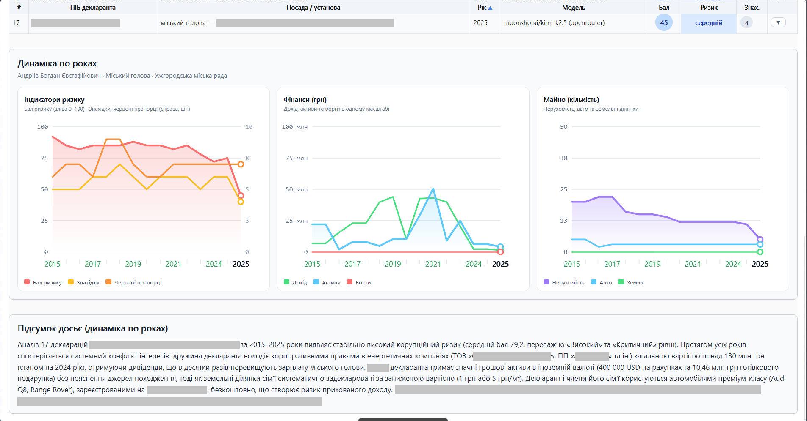
</p>

---

## ✨ Features at a glance

- 📁 **One declaration or a whole folder** — batch processing, with a queue, pause/cancel, and resume after an interruption (already-processed files aren't re-analyzed).
- 🔌 **Three paths to AI:**
  - 🖥️ **local [Ollama](https://ollama.com)** — full privacy, data never leaves your machine;
  - ☁️ **cloud Ollama** via a token;
  - 🌐 **[OpenRouter](https://openrouter.ai)** — 100+ models, up to 8 declarations processed concurrently, live token/cost accounting (usually cents per declaration, depending on the model).
- 🕵️ **Deep Research** — chronological analysis of all of one person's declarations, with charts.
- 📊 **Ready-made reports** — interactive HTML, CSV, an LLM dossier summary.
- 📈 **Usage dashboard** — how many were processed, the risk breakdown, the most common findings, an estimate of time saved.
- 🛠️ **DEBUG mode** — more on this below.
- 🖱️ **GUI + CLI** — a friendly app and a full command line for scripting.

---

## 🧰 Tech stack

| Layer | Technology |
|-------|------------|
| 🪟 GUI | [PyWebView](https://pywebview.flowrl.com/) 5 (Edge Chromium on Windows) |
| ⚛️ Frontend | React 18 + Vite 5, Geist font |
| 🐍 Backend | Python 3.10+, almost no external dependencies |
| 🖥️ LLM local | [Ollama](https://ollama.com) `/api/chat` |
| 🌐 LLM cloud | [OpenRouter](https://openrouter.ai/docs) (OpenAI-compatible) |
| 🏛️ Data source | NAZK's open [public API](https://public.nazk.gov.ua/public_api) (`public-api.nazk.gov.ua/v2`) |
| 📄 Reports | Interactive HTML + CSV, JSONL |
| 📦 Packaging | PyInstaller (onefile, no console) |

---

## 🚀 Quick start

> 💻 **Requirements (honest about the platform).** Built and tested **on Windows**: the UI uses Edge Chromium (WebView2) via `pywebview` + `pythonnet` (.NET), and some spots call Win32 directly. `pywebview` is nominally cross-platform, but running on macOS/Linux out of the box is **not guaranteed** — it would take code changes. You'll also need: **Python 3.10+**, **Node.js** (once, to build the frontend), and either **[Ollama](https://ollama.com)** for local models or an **[OpenRouter](https://openrouter.ai) key** for the cloud.

```bash
# 1. Install Python dependencies
python -m pip install -r requirements.txt

# 2. Build the frontend — ONCE, before the first GUI launch (or BUILD_FRONTEND.bat)
cd declarator-lm && npm install && npm run build && cd ..

# 3. Launch the app (Ukrainian)
python webview_app.py

#    ...or in English
python webview_app_en.py      # (or run_en.bat on Windows)

# 4. Or from the command line (no frontend needed) — every declaration in a folder
python main.py --input-dir dataset_declarations --model llama3.1

# 5. Or via OpenRouter (cloud, 100+ models)
python main.py --input-dir dataset_declarations \
  --provider openrouter \
  --openrouter-model meta-llama/llama-3.3-70b-instruct \
  --openrouter-api-key sk-or-v1-...
```

> ℹ️ Step 2 (building the frontend) is only for the GUI and is done once — a fresh clone has no `declarator-lm/dist/` yet. The command-line mode (`main.py`) works without it.

The full command-line reference (`--timeout`, `--retries`, `--max-chars`, `--sort-order`, `--max-concurrent-declarations`, etc.) lives in [STRUCTURE.en.md](STRUCTURE.en.md#2-backend-mainpy).

---

<a id="which-model"></a>

## 🧠 Which model to use

This decides almost everything. The same tool with different models produces anything from "genuinely useful" to "complete garbage" — so don't judge the project by a weak model.

> ⚠️ The default `llama3.1` (8B) in the examples is there only **so that it launches at all**. For real declaration analysis it's **too weak** — it confuses numbers and relationships (confirmed in practice). Don't judge by it.

**A rough guide:**

| Scenario | Recommendation |
|----------|----------------|
| 🖥️ **Local** (private, your own GPU) | Not many home PCs can run a 32B model — and that's fine. A practical floor: **Qwen 3 or newer**, or **Llama 3 or newer**, at **12B parameters or more**, preferably a **fine-tuned checkpoint** rather than the raw original model at the same size — it tends to be more accurate for this task. Smaller models are "just to play around." |
| 🌐 **Cloud** (OpenRouter) | In the author's own runs, **Qwen 3** and **Kimi K2.5/K2.6** have performed best — consistently accurate; Kimi K2.5 has never let me down. That said, this isn't a rigorous benchmark, just personal experience — a systematic model comparison for this specific task hasn't been done yet; it's an open question worth further testing. |

The rule of thumb: **weak analysis is almost always a weak model, not a broken tool.** Before drawing conclusions about quality, try a more capable model.

---

## 🧹 How the cleanup works (compact v2)

A raw NAZK declaration is ~11,000 characters of technical JSON. Here's what the program does to it **before showing it to the AI:**

1. 👤 **Decodes the people.** Builds a "who's who" table (the subject, spouse, children) and replaces raw `rightBelongs: "2"` with readable "spouse: Maria Ivanenko."
2. 📂 **Sorts it onto shelves.** Turns 13 of the 18 declaration sections into clean structured blocks: family, real estate, vehicles, income, cash, liabilities, corporate rights, **banks and accounts**, and more.
3. 🧮 **Computes totals** — total income, cash, property and vehicle value, liabilities.
4. 🗑️ **Strips the noise** — internal ids, service codes, empty placeholders.

> 📎 **Why "13 of 18" and not all 18 — and why that's fine.** A coder will notice right away: not every section is structured. But the rest is **not "lost"** and isn't unreadable to the model. Those 5 sections (securities, share capital participation, intangible assets, etc.) are **genuinely rare** in real declarations — there simply weren't enough examples to build a dedicated structure for them. When they do appear, they're passed to the model as a **cleaned-up raw fragment** (the AI reads it fine), not discarded. So: 13 common sections are neatly shelved, 5 rare ones are passed "as-is, but clean." Nothing disappears.

> 🎚️ **A safety net, just in case.** Settings have an **"Economical / Detailed"** toggle (with a "?" hint right next to it that spells this out). The default is "Economical": clean compact, fast and cheap. If it ever seems the model "missed" something, switch to **"Detailed"** — and the **full raw copy** of every filled step is attached alongside the compact form, exactly as in the register's original JSON: the model sees every field and every original wording. Across all the (long) testing this was never needed — but the option is always at hand.

The result is a compact, readable JSON where **the declaration's content is preserved and the technical junk is gone.** A detailed step-by-step breakdown is in [raw-compact.md](raw-compact.md) (Ukrainian).

---

## 🛠️ DEBUG mode

Behind the outward simplicity hides a full workshop for those who want to look "under the hood" — developers, researchers, anyone tuning prompts or checking analysis quality.

### How to enable it

> 🔑 **Shift + four quick clicks on the «Д» logo** (top-left corner of the window) within 2 seconds.

No restart needed — a **"DEBUG settings"** block appears in the sidebar immediately, and a `Debug` badge shows up in the header.

### What's inside

| 🧩 Tool | What it does |
|---------|-------------|
| ✏️ **Prompt editor** | Edit the system and user prompts (and the dossier prompt) right in the app — changes apply to the current session only, the project code is untouched. There's a "Reset to built-in" button. |
| 🔬 **Audit mode** | Saves the full processing chain for each declaration into its own folder: raw declaration → compact → the request payload to the model → the raw response → the parsed JSON → the normalized analysis → attempt metadata. **Seven separate toggles** — capture only what you need. Indispensable for understanding *why* the model decided the way it did. |
| ⚖️ **Model comparison** | Runs **one** declaration through 2–4 different models and shows the results side by side — to see which model is more accurate. |
| 📄 **Dossier summary** | Without the full pipeline: the model reads a finished HTML report and appends a text summary to it. |
| 🔄 **Regenerate HTML + CSV** | Rebuilds the report from an existing JSONL without re-analyzing. |
| 📟 **System load** | Shows CPU / RAM / GPU while running. |
| 🧽 **Wipe usage traces** | One click clears all local results, reports, and temporary files. |

<table>
<tr>
<td width="50%">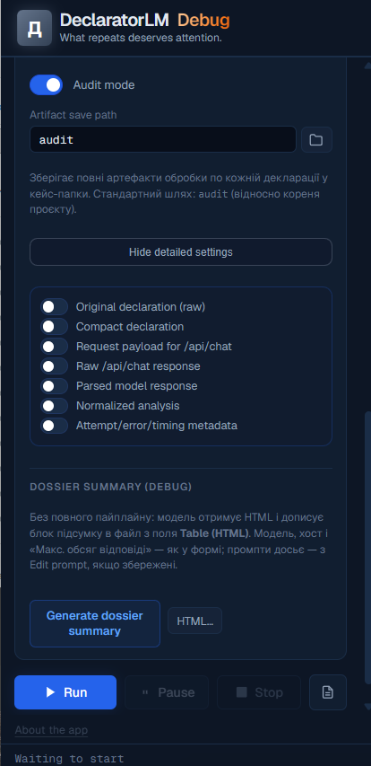</td>
<td width="50%">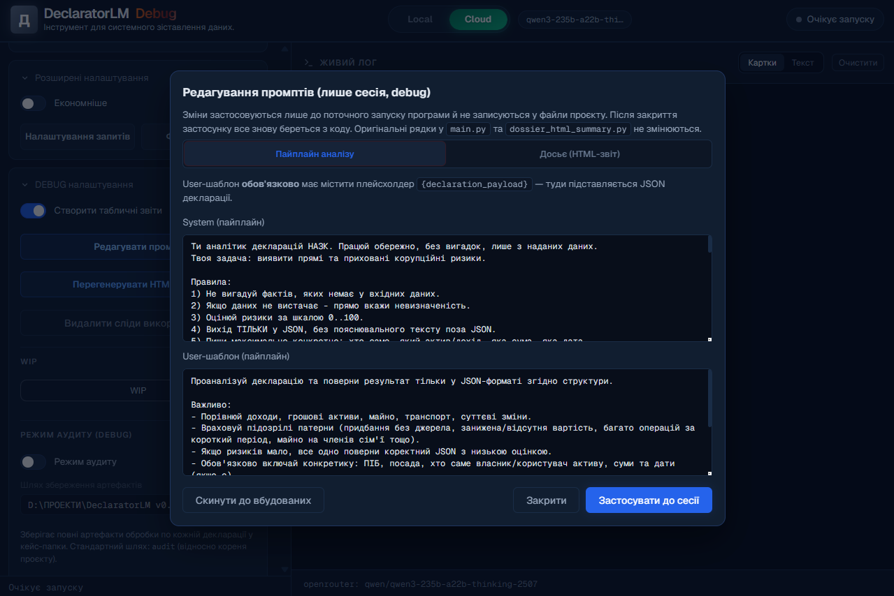</td>
</tr>
<tr>
<td width="50%"><sub>🔬 Audit mode — seven toggles for exactly what to save per declaration.</sub></td>
<td width="50%"><sub>✏️ Prompt editor — the system and user templates, session-scoped.</sub></td>
</tr>
</table>

---

## 🏛️ Deep Research and the NAZK API

Ukrainian declarations have been public since 2016, and access is provided by the **open API of the [National Agency on Corruption Prevention](https://public.nazk.gov.ua/public_api)** (`public-api.nazk.gov.ua/v2` — no key, no authentication). DeclaratorLM can:

- 📄 download a **single** declaration by its `declaration_id`;
- 🕵️ download **every** declaration filed by one person, by `user_declarant_id` — this is "Deep Research" mode: you can see how assets and risk changed over the years;
- 📦 bulk-download declarations **for a given year** (with filters) to build your own research corpus.

> 🌍 **Testing the original intent from outside Ukraine?** The NAZK API is a Ukrainian government service, and it may be unreachable or unreliable from some countries' networks. If downloading declarations fails or times out, try connecting through a Ukrainian VPN before assuming something in the tool is broken.

> 🧭 **Where the IDs come from — and why you don't hunt for them by hand.**
> - `declaration_id` (for "download one") is simply the end of a declaration's address on the NAZK site: `https://public.nazk.gov.ua/documents/XXXXXXXX` → that `XXXXXXXX`.
> - `user_declarant_id` (for dossier mode) is **not shown on the NAZK site** — and you don't need to dig for it. The typical flow is self-contained: you download a batch of declarations from the API (e.g. for a given year), analyze them, and when one looks suspicious by risk and facts, you expand the **"Technical details"** block in its card, where the `user_declarant_id` sits. Then you switch on dossier mode with that ID and get that person's full year-by-year history. In other words, the tool itself points you to whose dossier is worth assembling.

🔗 Every processed declaration in the report links back to its original filing on **[public.nazk.gov.ua](https://public.nazk.gov.ua/)** — so an AI conclusion can always be checked against the primary source.

---

## 🌍 Multi-language support (UA / EN)

The app ships with Ukrainian and English interfaces. The language is chosen **at launch**:

```bash
python webview_app.py       # Ukrainian
python webview_app_en.py    # English
```

Under the hood it's one React app with two entry points. The model's analysis and the declarations themselves stay in their original language — only the app's interface is translated.

> ⚠️ **The English translation is not complete — here's exactly what's missing, and how you could take this further than English.** Three separate things are going on:
> 1. **The app window (UI shell) — partially covered, actively improving.** Translation works by matching Ukrainian strings against a dictionary: `declarator-lm/src/i18n/enCatalog.js` (plus `enCatalogExtras.js`, a growing second catalog file) holds exact Ukrainian → English pairs, normalized for whitespace/apostrophe variants; `domTranslate.js` walks the DOM (with a `MutationObserver` for anything added later, like log cards), matching leaf text nodes, whole-element text for simple containers, and translatable attributes (`title`/`aria-label`/`placeholder`/`alt`). Rich-text content that's just too long/free-form to dictionary-match (like the help modals) instead gets a hand-written English counterpart in `declarator-lm/src/i18n/modalsEn.jsx`, swapped in by `App.jsx` directly. `App.jsx` itself is still hardcoded Ukrainian and never calls `useI18n`/`useT`. So any Ukrainian string with no catalog entry yet still silently stays in Ukrainian in the English build — the mechanism has gotten more capable, but coverage is still a moving target.
> 2. **The generated HTML report — the bigger gap.** `report_table.html` (the actual analysis output you get at the end) is **Ukrainian-only, full stop, with no other-language mode at all right now.** `report_i18n.py` only has `*_UK` dictionaries (finding types, risk levels, profile field labels), and `report.py`, `dossier_charts_html.py`, and `dossier_html_summary.py` all have their table headers, section titles, filter placeholders, and chart labels hardcoded in Ukrainian directly in the Python — e.g. `"ПІБ декларанта"`, `"Посада / установа"`, `"Знахідки AI"`, `"Індикатори ризику"`. None of it reads the app's current UI language.
> 3. **The language-switching mechanism itself is wired for exactly one alternate language, not language-agnostic.** `webview_app.py`'s `_ui_lang()` only special-cases `"en"` — anything else falls through to Ukrainian; `_frontend_index_path()` only knows to look for `dist/index.en.html`; `vite.config.js`'s `rollupOptions.input` hardcodes exactly two entries (`main`, `en`). Adding a third UI language means extending these, not just adding a bigger dictionary.
>
> **This isn't only about finishing English.** If you'd rather see the app fully in French, Spanish, German, or anything else, the same architecture applies — you'd just be building a new language pack instead of extending the English one. Here are two ready-to-use prompts for an AI coding assistant (like Claude Code) working in this repo — written generically, so swap in whichever language you actually want:
>
> <details>
> <summary><strong>Prompt: add or finish a UI translation for a target language</strong></summary>
>
> ```text
> I want the DeclaratorLM UI shell available in <TARGET LANGUAGE> (e.g. French,
> Spanish, German — pick one). Two cases, handle whichever applies:
>
> (a) English already has a partial translation — study
>     declarator-lm/src/i18n/enCatalog.js, enCatalogExtras.js, domTranslate.js,
>     and modalsEn.jsx to understand the pattern (dictionary matching with
>     normalization for simple strings, a MutationObserver-driven DOM walker
>     for elements/attributes, hand-written English components for long
>     rich-text content that can't be dictionary-matched), then replicate the
>     same pattern for <TARGET LANGUAGE>: a new <lang>Catalog.js (+
>     <lang>CatalogExtras.js if it grows large) and a new modals<Lang>.jsx.
>
> (b) No translation exists yet for <TARGET LANGUAGE> — build the same pattern
>     from scratch, reusing domTranslate.js's matching logic (it's already
>     language-agnostic; it just needs a catalog to match against).
>
> Either way, also wire up the entry points, which currently only know about
> "en": add a new Vite build entry in declarator-lm/vite.config.js
> (rollupOptions.input), a new declarator-lm/index.<lang>.html, and a new
> declarator-lm/src/main.<lang>.jsx (mirror main.en.jsx: wrap <App/> in
> <I18nProvider locale="<lang>">, call installDomTranslator). On the Python
> side, generalize webview_app.py's _ui_lang() (currently only recognizes
> "en" via DECLARATOR_UI_LANG/DECLARATOR_LANG/--lang, else falls back to
> Ukrainian) and _frontend_index_path() (currently only looks for
> dist/index.en.html) to handle an arbitrary language code, not just "en".
>
> Then audit every user-facing string in App.jsx, DossierPanel.jsx,
> DossierCharts.jsx, UsageDashboard.jsx, and VisualLogPanel.jsx against your
> new catalog, launch the app with the new language selected, exercise every
> screen and modal (including DEBUG mode, unlocked via Shift + four clicks on
> the logo), and report any strings that can't be caught this way because
> they're generated too dynamically for the DOM walker to match.
> ```
>
> </details>
>
> <details>
> <summary><strong>Prompt: translate the generated HTML report</strong></summary>
>
> ```text
> The generated report_table.html (built by report.py, with
> dossier_charts_html.py and dossier_html_summary.py appending charts and an
> LLM summary) is entirely hardcoded in Ukrainian and has no other-language
> mode. Make the output language configurable rather than hardcoding a
> "protected" default: mirror report_i18n.py's FINDING_TYPE_UK / RISK_LEVEL_UK
> / SEVERITY_UK / PROFILE_FIELD_UK dictionaries with equivalents for whichever
> language(s) you want (English first is reasonable, but design it so adding
> a second or third language later is just another dictionary, not a rewrite),
> thread a language parameter through report.py's HTML-building functions
> (write_filterable_html and friends) so every hardcoded string in the
> template — table headers, filter placeholders, section titles like
> "Знахідки AI" / "Потребує перевірки" / "Висновок" — resolves per language,
> and do the same for the hardcoded chart titles/legends in
> dossier_charts_html.py (e.g. "Індикатори ризику", "Фінанси (грн)", "Дохід",
> "Активи", "Борги") and the summary prompt language in dossier_html_summary.py.
> Wire the language choice to the same signal webview_app.py resolves for the
> UI. Don't treat the Ukrainian strings as a fixed default that must be
> preserved byte-for-byte — if this is a fork, the upstream repo already has
> the original Ukrainian behavior; feel free to make whichever language you
> need the actual default for your copy.
> ```
>
> </details>

---

## 📂 Project structure

| File / folder | Purpose |
|---------------|---------|
| 🐍 `main.py` | Core: cleanup (compact v2), LLM calls, pipeline, CLI |
| 🪟 `webview_app.py` | App server (UA), bridge to `main.py` |
| 🌐 `webview_app_en.py` | The same server in English |
| ☁️ `openrouter_client.py` | Cloud-model client (OpenRouter) |
| 🏛️ `deep_research_bridge.py` | Downloading declarations from the NAZK API |
| 📊 `report.py` | HTML + CSV report generation |
| 📈 `dossier_charts*.py` | Trend charts for dossier mode |
| 📝 `dossier_html_summary.py` | LLM dossier summary + model comparison |
| 📟 `usage_dashboard.py` | Usage statistics |
| ⚛️ `declarator-lm/` | React frontend |
| 🔌 `nazk_parser/` | Open NAZK API client |
| 🧪 `tools/` | Analysis/validation scripts |
| 🖼️ `docs/screenshots/` | Screenshots for the docs |

The full, detailed architecture — every API method and data format — is in **[STRUCTURE.en.md](STRUCTURE.en.md)**.

---

<a id="privacy"></a>

## 🔒 Privacy and local data

- 🖥️ With **local Ollama**, declarations and results never leave your machine.
- ☁️ With **cloud providers**, declaration content is sent to an external API under your key — don't use the cloud for sensitive corpora without understanding that provider's data policy.
- 🙈 Local data (downloaded declarations, results, settings, keys) is intentionally excluded from git — see [`.gitignore`](.gitignore).
- ⚖️ NAZK declarations are public by law — using them here is not a personal-data leak, it's exactly what the open register exists for.

---

## 🗺️ Roadmap

### ✅ Done
- Compact v2 cleanup: −74% characters, structuring of 13/18 sections including banks
- Three providers: local Ollama, Cloud Ollama, OpenRouter (up to 8 threads)
- Deep Research: chronological analysis of all of a person's declarations, with charts
- Dossier summary + 2–4 model comparison
- Usage dashboard
- Audit mode: saving every processing artifact
- Resume after an interruption
- Full prompt control from the UI (session-scoped)
- Ukrainian and English interfaces

### 🧭 Deliberately deferred
- **A reproducible risk-score rubric.** Right now the 0–100 score is the AI's holistic judgment from the text prompt, not a fixed point system for specific patterns (for example: "right to use a premium-class vehicle owned by a third party → +30", "cash/account balances disproportionate to declared income → +10", and so on). So the same input can score differently across models or runs — the score is currently a qualitative judgment, not strictly reproducible. Writing down explicit, checkable scoring rules is a deliberately postponed piece of work, not an oversight.

### 🔮 Potential next steps
- Structuring the rare sections 5, 7, 8, 10, 16
- Vector search / comparison of declarations across people
- Integration with other registries (State Land Cadastre, Unified State Register) for cross-checking
- A web version / REST API

---

## 👤 Status, license, author

<p align="center">
  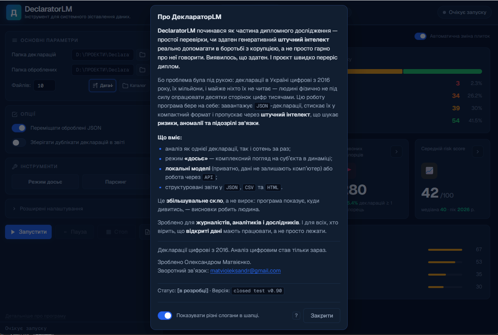
</p>

The app is at a **beta** stage (v0.90): functional, with active refinement and testing. The source is open under the **[Apache 2.0](LICENSE)** license — free to use, modify, and distribute, including adapting it for other countries (see [PORTING.md](PORTING.md)), provided you keep the copyright notice and the license text. © 2026 Oleksandr Matviienko.

> 💬 *"Built for journalists, analysts, and researchers. And for everyone who believes open data should work, not just sit there."*

Built by Oleksandr Matviienko. Contact: [ctrlredtape@gmail.com](mailto:ctrlredtape@gmail.com).
