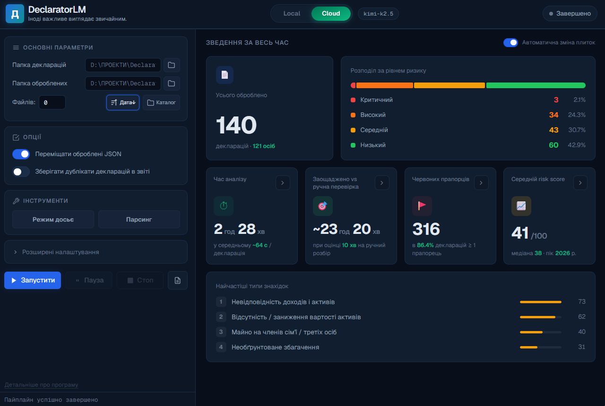
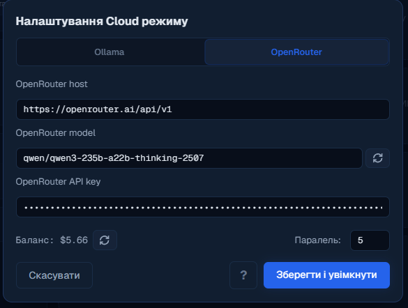
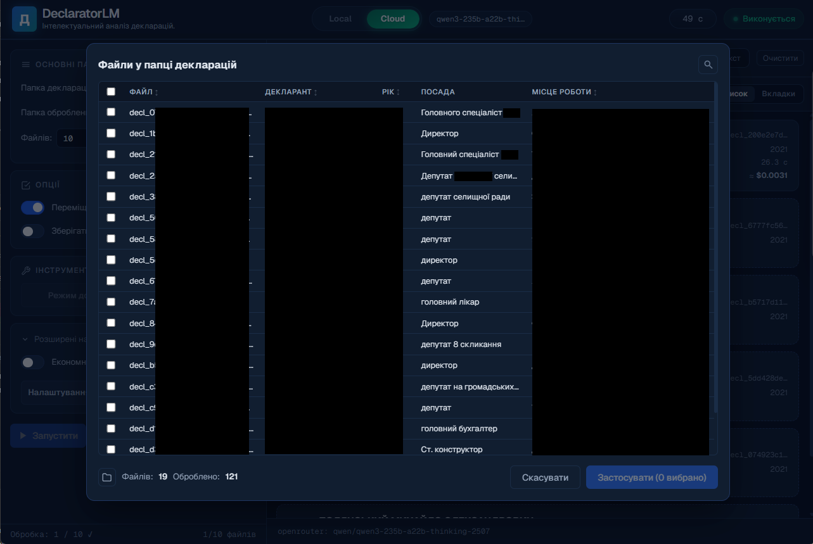
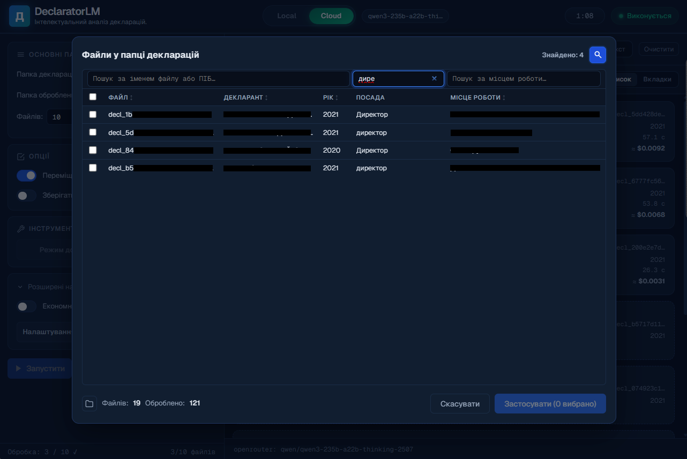
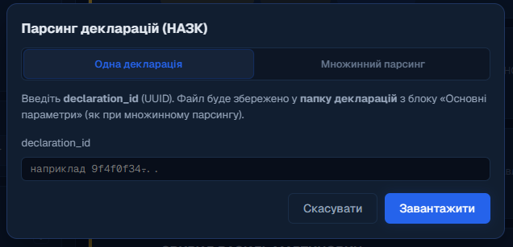
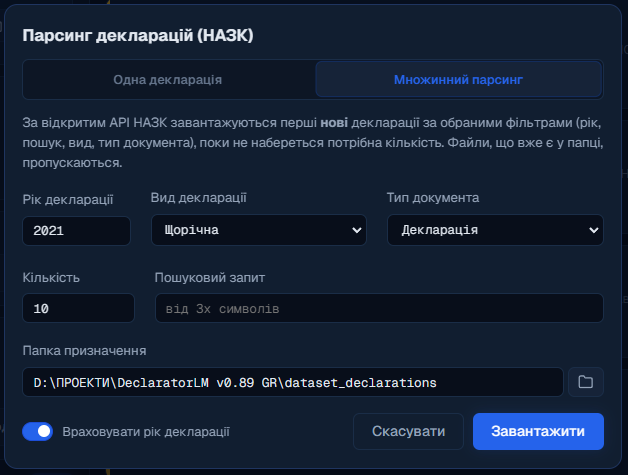
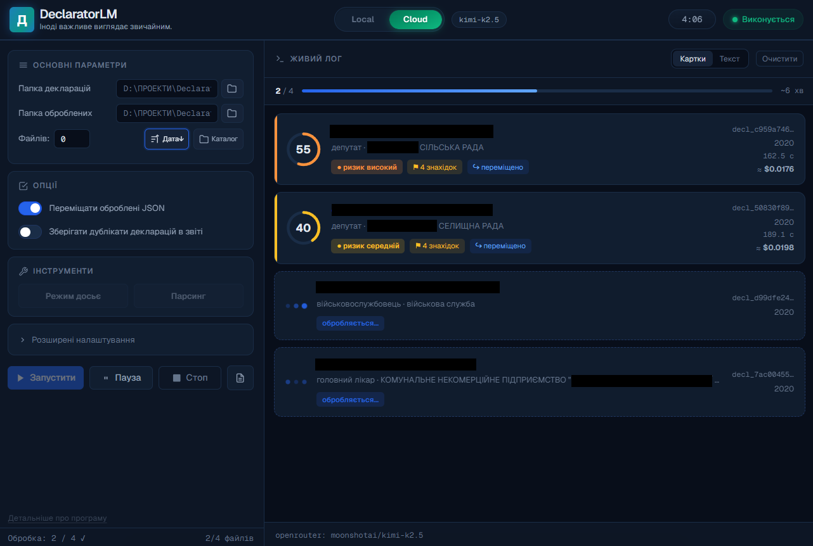
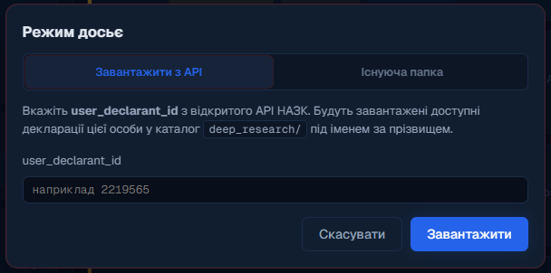
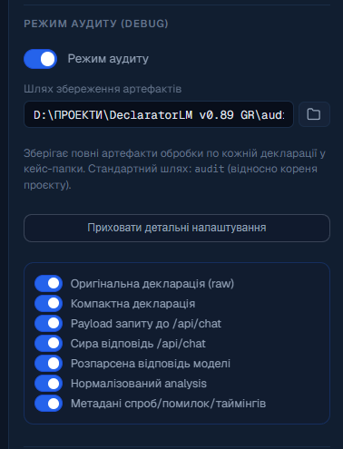

# DeclaratorLM

### 🔍 Читає е-декларацію так, як прочитав би журналіст-розслідувач — а не втомлена людина о другій ночі.

**Що це.** В Україні посадовці, депутати, судді та інші публічні особи щороку подають до [НАЗК](https://public.nazk.gov.ua/public_api) електронні декларації — офіційні звіти про свої статки, доходи й майно родини. Ці декларації публічні. DeclaratorLM бере таку декларацію, чистить її й пропускає через штучний інтелект, який шукає ознаки корупції: невідповідність статків доходам, майно на третіх осіб, підозрілі патерни. На виході — risk-score, конкретні знахідки з доказами й посилання на першоджерело. Створено для журналістів, антикорупційних дослідників і розробників civic-tech, яким треба відсіювати більше декларацій, ніж можна прочитати вручну. Локально на вашому комп'ютері або через хмарні моделі — на вибір.

> 📌 **Одразу про головне: сфера застосування та роль інструмента.**
> - **Спеціалізація вузька і свідома.** Інструмент заточений під **український контекст**: формат даних, розбір кроків декларації, розв'язання родинних зв'язків, промпти — усе прив'язане до структури відкритого API НАЗК. Це не універсальний аналізатор «декларацій узагалі» — він працює саме з реєстром НАЗК (Україна). Під декларації іншої країни його треба адаптувати, і код для цього відкритий.
> - **Це потужний аналітичний інструмент — але саме інструмент.** DeclaratorLM робить важку роботу: чистить, структурує, аналізує, будує звіти й показує, **куди дивитися**. А остаточні оцінки, висновки й рішення лишаються за людиною — так і має бути (докладніше — [«Правові та етичні межі»](#legal-boundaries)).

<p align="center">
  
</p>

<p align="center">
  📖 <b><a href="README.en.md">English version / Англійська версія →</a></b>
</p>

---

## 🧨 Проблема

В Україні декларації чиновників публічні й цифрові з 2016 року. Звучить як мрія для контролю за владою. Але на практиці:

- 📈 **Декларацій — мільйони.** Щороку їх подають сотні тисяч людей, і архів лише зростає.
- 👥 **Тих, хто їх реально читає — сотні.** У кращому разі — тисячі. Журналісти, аналітики, активісти, слідчі. Одна людина фізично не здатна вручну опрацювати десятки сторінок цифр — а таких декларацій мільйони.
- 🗃️ **Дані «брудні».** API НАЗК віддає кожну декларацію як великий, технічний і незручний для читання JSON: внутрішні коди, службові поля, плейсхолдери `[Конфіденційна інформація]`, посилання на осіб через числові id. Щоб зрозуміти, кому належить квартира, треба вручну зіставляти таблиці.

> **Підсумок:** відкриті дані існують, але значною мірою лежать без діла. Їх важко читати вручну масово, а формат відлякує навіть тих, хто б хотів.

**DeclaratorLM береться за обидві проблеми.** Він *автоматично* чистить технічний JSON до людяної суті **та** передає її штучному інтелекту, який готує першу чернетку аналізу — з очищенням, структуруванням, графіками й готовими звітами.

Працює він **пакетно й автоматично** — завантаження, очищення, аналіз, звіти, — з чергою, паузою та відновленням після переривання. Скільки опрацювати за раз — залежить від ваших ресурсів (моделі, часу, бюджету на хмару), а не від штучних обмежень інструмента. На практиці його наводять на цільову вибірку — орган, регіон, рік — і аналітик проходить її помітно швидше, ніж вручну. Куди дивитися — підказує машина; що з цим робити — вирішує людина.

---

## ⚙️ Як це працює

Один простий конвеєр — від сирого файлу до готового висновку:

**📥 Декларація  →  🧹 Compact v2  →  🤖 Штучний інтелект  →  📊 Звіт**

| 📥 Декларація | 🧹 Compact v2 | 🤖 Штучний інтелект | 📊 Звіт |
|---------------|---------------|---------------------|---------|
| JSON з НАЗК, ~11 000 символів «брудного» тексту | чистий, ~3 000 символів (−74%) — лише суть | шукає ризики, аномалії, підозрілі зв'язки | HTML + CSV, графіки, резюме |
| *що завантажив чиновник* | *прибрано шум, імена замість id* | *risk-score 0–100, знахідки з доказами* | *фільтри, пошук, посилання на НАЗК* |

1. **📥 Завантаження.** Ви даєте програмі папку з деклараціями або одразу тягнете їх з [API НАЗК](https://public.nazk.gov.ua/public_api) за іменем чи ID особи.
2. **🧹 Очищення (compact v2).** Програма викидає технічний шум, розшифровує внутрішні коди й перетворює «власник = особа №2» на «дружина: Іваненко Марія». Декларація стає **втричі коротшою**, а весь зміст лишається на місці (а на всяк випадок є режим «Детальніше» — про нього нижче).
3. **🤖 Аналіз.** Стисла декларація йде до моделі (локальної або хмарної), яка порівнює доходи з активами й шукає ознаки корупції.
4. **📊 Звіт.** Результат — інтерактивна HTML-таблиця, CSV та (у режимі досьє) графіки динаміки по роках.

---

## 🎯 Що саме аналізується

Модель не просто «читає текст» — вона зіставляє конкретні речі й шукає конкретні тривожні патерни:

| Що порівнюється | На що дивиться штучний інтелект |
|-----------------|-------------------------------|
| 💰 **Доходи ↔ активи** | Чи відповідає рівень життя офіційній зарплаті |
| 🏠 **Нерухомість і земля** | Майно без оцінки вартості, занижена вартість, підозріло дешеві угоди |
| 🚗 **Транспорт** | Авто преміум-класу, особливо оформлені на інших осіб |
| 💵 **Готівка й рахунки** | Суми готівки/на рахунках, непропорційні задекларованому доходу |
| 🏦 **Банки та фінустанови** | Де саме відкриті рахунки, на кого |
| 🏢 **Корпоративні права** | Бізнес, бенефіціарне володіння, конфлікт інтересів |
| 👨‍👩‍👧 **Активи родини** | Майно, «переписане» на членів сім'ї чи третіх осіб |
| 📅 **Істотні зміни** | Багато великих операцій за короткий період, придбання без джерела коштів |

На виході по кожній декларації ви отримуєте:

- 🔢 **Risk-score 0–100** та рівень ризику (низький / середній / високий / критичний);
- 🚩 **Знахідки** — конкретні підозри, кожна з доказами, іменами й сумами;
- 🧾 **Red flags** та список того, **що потребує ручної перевірки**;
- ✅ **Узгоджені факти** — що, навпаки, виглядає нормально й чому;
- 📝 **Фінальний висновок** — коротке резюме людською мовою.

> ⚠️ **Важливо, і не дрібним шрифтом:**
> - 🔍 Це «збільшувальне скло, а не вирок». Програма показує, **куди дивитися** — рішення завжди робить людина.
> - 🕳️ **Низький бал ≠ «чисто».** Модель може *не помітити* прихованого. Низький ризик означає лише «тут ШІ не побачив очевидного», а не «людина точно чесна». Хибний спокій — така сама небезпека, як і хибна підозра.
> - 🧠 **Якість результату напряму залежить від обраної моделі** (див. розділ [«Яку модель брати»](#which-model) нижче). Слабка модель = слабкий, іноді хибний аналіз — і це обмеження *моделі*, а не даних чи самого інструмента.
> - 🚫 Модель отримує пряму заборону вигадувати факти й повинна спиратися лише на дані декларації — але, як і будь-який ШІ, іноді все одно помиляється.

---

<a id="legal-boundaries"></a>

## ⚖️ Правові та етичні межі

Це найважливіший розділ. DeclaratorLM **не** вирішує, хто корупціонер, і **нікого ні в чому не звинувачує.** Він створений як **демонстраційно-аналітичний інструмент** і не ухвалює жодних рішень. Ось чому ця межа проведена свідомо — і на чому вона стоїть.

### ✅ Чому аналізувати ці дані — законно

- **Дані вже публічні за законом.** Ст. 47 [Закону України «Про запобігання корупції»](https://zakon.rada.gov.ua/laws/show/1700-18) (№ 1700-VII) прямо встановлює, що Єдиний державний реєстр декларацій є **відкритим**, з цілодобовим доступом, і надається у машиночитаному форматі **саме для повторного використання** (automated processing, reuse). Тобто автоматизований аналіз декларацій — це не обхід, а *передбачений законом сценарій* використання цих даних.
- **Право на роботу з інформацією.** Ст. 34 [Конституції України](https://zakon.rada.gov.ua/laws/show/254%D0%BA/96-%D0%B2%D1%80) гарантує кожному право **вільно збирати, зберігати, використовувати й поширювати інформацію**.
- **Приватність поважається — і це вбудовано в код.** Та сама ст. 47 закриває доступ до чутливих полів: РНОКПП, паспорт, місце проживання, дата народження, точне місцезнаходження об'єктів. Самі декларації у відкритому доступі вже **без цих даних**, а етап очищення `compact v2` додатково відкидає рештки службових ідентифікаторів ще до того, як декларація потрапляє до моделі.

> 🔁 **Ця відсутність точних даних — палиця з двома кінцями, і чесно назвати обидва:**
> - ➕ **Плюс (приватність і безпека).** Модель фізично не бачить нічого зайвого. Навіть якщо хмарний провайдер закешує ваш запит — у ньому немає ні адрес, ні паспортів, ні дат народження. Нічого чутливого просто нема чому «витекти».
> - ➖ **Мінус (перевірюваність).** Без точної адреси чи ідентифікаторів **неможливо автоматично звірити** об'єкт із зовнішніми реєстрами (напр., ту саму квартиру за адресою в Держреєстрі речових прав). Межу проведено на боці приватності — це свідомий компроміс закону, не хиба інструмента.

### 🚫 Чому висновок — це НЕ вирок

- **Презумпція невинуватості.** Ст. 62 [Конституції України](https://zakon.rada.gov.ua/laws/show/254%D0%BA/96-%D0%B2%D1%80): особа вважається невинуватою, доки її вину не доведено **законним порядком і встановлено обвинувальним вироком суду**. Обвинувачення **не може ґрунтуватися на припущеннях**, а всі сумніви тлумачаться на користь особи. Risk-score програми — це припущення й гіпотеза, а не доведення вини.
- **Це «оціночне судження», а не факт.** Ст. 30 [Закону України «Про інформацію»](https://zakon.rada.gov.ua/laws/show/2657-12) (№ 2657-XII) розрізняє **фактологічні твердження** й **оціночні судження** — останні не підлягають доведенню правдивості. Знахідки DeclaratorLM за своєю природою є оціночними судженнями та підказками «на що звернути увагу», а не констатацією фактів про чиюсь провину.
- **Офіційна перевірка — не наша компетенція.** Ст. 50 Закону № 1700-VII покладає **повну перевірку декларацій** (достовірність даних, точність оцінки активів, ознаки незаконного збагачення) виключно на **НАЗК**. Встановлення вини — на суд. Приватний інструмент цього робити не може й не робить — він лише допомагає людині вирішити, які декларації варто передати тим, хто має відповідні повноваження.

### 🔬 Прозорість як запобіжник

Головна етична гарантія — те, що система **не «чорна скринька».** Кожна знахідка й кожен бал спираються на конкретні дані декларації, з посиланням на першоджерело на public.nazk.gov.ua. А **DEBUG-режим аудиту** зберігає **весь ланцюжок обробки** (сира декларація → compact → запит до моделі → відповідь → нормалізований результат), тож будь-який висновок можна **відтворити й дослідити**, а не приймати на віру. Це протилежність «ШІ сказав — значить винен».

> 📌 Підсумок межі: **дані публічні → аналізувати можна; висновок — гіпотеза й оціночне судження → нікого не звинувачує; офіційні рішення — за НАЗК і судом.**
>
> *Цей розділ відображає добросовісну правову позицію проєкту, а не юридичну консультацію. Використання інструмента — на відповідальність користувача, з дотриманням законодавства України та етичних норм журналістики й досліджень.*

---

## 🖼️ Як це виглядає

**📈 Дашборд використання** — те, що ви бачите, коли нічого не запущено: скільки декларацій оброблено, розподіл за рівнем ризику, заощаджений час, найчастіші типи знахідок:

<p align="center">
  
</p>

<table>
<tr>
<td width="50%">

**☁️ Налаштування хмарного провайдера**


</td>
<td width="50%">

**🗂️ Каталог декларацій**


</td>
</tr>
<tr>
<td width="50%">

**🔎 Пошук у каталозі**


</td>
<td width="50%">

**📥 Завантаження однієї декларації з НАЗК**


</td>
</tr>
<tr>
<td width="50%">

**📦 Пакетне завантаження з НАЗК**


</td>
<td width="50%">

**⏳ Живий лог обробки**


</td>
</tr>
</table>

<p align="center">
  
  <br><sub>✅ Завершений пакет: risk-score, кількість знахідок, вартість і токени по кожній декларації.</sub>
</p>

**📊 Інтерактивний HTML-звіт** — фільтри за ризиком, посадою, моделлю; розгортання повного аналізу по кожному декларанту; знахідки з доказами; огляд активів родини; клікабельне посилання на оригінал декларації на public.nazk.gov.ua:

<p align="center">
  
</p>
<p align="center">
  
  <br><sub>Розгорнутий рядок: знахідки з доказами, активи родини, що перевірити, і фінальний висновок.</sub>
</p>
<p align="center">
  
  <br><sub>Той самий звіт, інший декларант — картка ризику підлаштовується під конкретні знахідки.</sub>
</p>

**🕵️ Режим «Досьє» (Deep Research)** — довантаження всіх декларацій однієї особи напряму з API або вибір локальної папки з уже завантаженими:

<table>
<tr>
<td width="50%"></td>
<td width="50%"></td>
</tr>
</table>

Під час самої обробки інтерфейс перемикається на червоний акцент і показує живий вигляд досьє — поточного декларанта та графіки, що оновлюються по мірі надходження результатів:

<p align="center">
  
</p>

Результат — звіт з усіма деклараціями особи в хронології:

<p align="center">
  
</p>

...і графіками динаміки ризику, фінансів і майна по роках, плюс LLM-резюме всього досьє:

<p align="center">
  
</p>

---

## ✨ Можливості коротко

- 📁 **Одна декларація або ціла папка** — пакетна обробка, черга, пауза/скасування, відновлення після переривання (вже оброблені файли не аналізуються повторно).
- 🔌 **Три шляхи до штучного інтелекту:**
  - 🖥️ **локальна [Ollama](https://ollama.com)** — повна приватність, дані не залишають комп'ютер;
  - ☁️ **хмарна Ollama** за токеном;
  - 🌐 **[OpenRouter](https://openrouter.ai)** — 100+ моделей, паралельна обробка до 8 декларацій одночасно, живий облік вартості в токенах і доларах (зазвичай — центи за декларацію, залежно від моделі).
- 🕵️ **Deep Research** — хронологічний аналіз усіх декларацій однієї особи, з графіками.
- 📊 **Готові звіти** — інтерактивний HTML, CSV, LLM-резюме досьє.
- 📈 **Дашборд використання** — скільки оброблено, розподіл ризиків, найчастіші знахідки, орієнтовний заощаджений час.
- 🛠️ **DEBUG-режим** — детальніше нижче.
- 🖱️ **GUI + CLI** — зручний застосунок і повноцінний командний рядок для скриптів.

---

## 🧰 Технологічний стек

| Шар | Технологія |
|-----|------------|
| 🪟 GUI | [PyWebView](https://pywebview.flowrl.com/) 5 (Edge Chromium на Windows) |
| ⚛️ Frontend | React 18 + Vite 5, шрифт Geist |
| 🐍 Backend | Python 3.10+, майже без зовнішніх залежностей |
| 🖥️ LLM локально | [Ollama](https://ollama.com) `/api/chat` |
| 🌐 LLM хмара | [OpenRouter](https://openrouter.ai/docs) (OpenAI-сумісний) |
| 🏛️ Джерело даних | Відкритий API [НАЗК](https://public.nazk.gov.ua/public_api) (`public-api.nazk.gov.ua/v2`) |
| 📄 Звіти | Інтерактивний HTML + CSV, JSONL |
| 📦 Збірка | PyInstaller (onefile, без консолі) |

---

## 🚀 Швидкий старт

> 💻 **Вимоги (чесно про платформу).** Розроблено й протестовано **під Windows**: інтерфейс використовує Edge Chromium (WebView2) через `pywebview` + `pythonnet` (.NET), а деякі місця прямо звертаються до Win32. Формально `pywebview` кросплатформний, але «з коробки» на macOS/Linux запуск **не гарантований** — знадобиться правка коду. Ще потрібні: **Python 3.10+**, **Node.js** (одноразово, щоб зібрати фронтенд), і або **[Ollama](https://ollama.com)** для локальних моделей, або **ключ [OpenRouter](https://openrouter.ai)** для хмари.

```bash
# 1. Встановити Python-залежності
python -m pip install -r requirements.txt

# 2. Зібрати фронтенд — ОДНОРАЗОВО, перед першим запуском GUI (або BUILD_FRONTEND.bat)
cd declarator-lm && npm install && npm run build && cd ..

# 3. Запустити застосунок (українською)
python webview_app.py

#    ...або англійською
python webview_app_en.py      # (чи run_en.bat у Windows)

# 4. Або з командного рядка (фронтенд не потрібен) — усі декларації з папки
python main.py --input-dir dataset_declarations --model llama3.1

# 5. Або через OpenRouter (хмара, 100+ моделей)
python main.py --input-dir dataset_declarations \
  --provider openrouter \
  --openrouter-model meta-llama/llama-3.3-70b-instruct \
  --openrouter-api-key sk-or-v1-...
```

> ℹ️ Крок 2 (збірка фронтенду) потрібен лише для GUI і робиться один раз — у свіжому клоні теки `declarator-lm/dist/` ще немає. Режим командного рядка (`main.py`) працює й без збірки.

Повний список параметрів командного рядка (`--timeout`, `--retries`, `--max-chars`, `--sort-order`, `--max-concurrent-declarations` тощо) — у [STRUCTURE.md](STRUCTURE.md#2-бекенд-mainpy).

---

<a id="which-model"></a>

## 🧠 Яку модель брати

Це вирішує майже все. Той самий інструмент з різними моделями дає результат від «дуже корисно» до «повне сміття» — тож не судіть про проєкт за слабкою моделлю.

> ⚠️ Дефолтна `llama3.1` (8B) у прикладах стоїть лише **«щоб взагалі запустилося»**. Для реального аналізу декларацій вона **заслабка** — плутає числа й зв'язки (перевірено на практиці). Не орієнтуйтеся на неї.

**Орієнтир:**

| Сценарій | Рекомендація |
|----------|--------------|
| 🖥️ **Локально** (приватно, свій GPU) | Мало який домашній ПК потягне 32B — і це нормально. Практичний орієнтир: **Qwen 3 і новіше**, або **Llama 3 і новіше**, від **12B параметрів**, бажано **дообучена (fine-tuned) версія**, а не сира оригінальна модель тієї ж розмірності — на цій задачі вона зазвичай точніша. Менші моделі — лише «побавитися». |
| 🌐 **Хмара** (OpenRouter) | У власних прогонах автора найкраще показали себе **Qwen 3** та **Kimi K2.5/K2.6** — стабільно точні; Kimi K2.5 жодного разу не підвела. Але це не строгий бенчмарк, а особистий досвід: системного порівняння моделей саме на цій задачі поки не проведено — тема відкрита для подальшого дослідження. |

Головне правило: **слабкий аналіз — це майже завжди слабка модель, а не зламаний інструмент.** Перш ніж робити висновки про якість, спробуйте гіднішу модель.

---

## 🧹 Як влаштоване очищення (compact v2)

Сира декларація НАЗК — це ~11 тис. символів технічного JSON. Ось що з нею робить програма, **перш ніж показати штучному інтелекту:**

1. 👤 **Розшифровує людей.** Будує таблицю «хто є хто» (суб'єкт, дружина/чоловік, діти) і замінює сирі `rightBelongs: "2"` на зрозуміле «дружина: Іваненко Марія Петрівна».
2. 📂 **Розкладає по поличках.** 13 із 18 розділів декларації перетворює на чіткі структуровані секції: родина, нерухомість, транспорт, доходи, готівка, зобов'язання, корпоративні права, **банки та рахунки** та інші.
3. 🧮 **Рахує підсумки** — сумарний дохід, готівку, вартість майна й транспорту, зобов'язання.
4. 🗑️ **Прибирає шум** — внутрішні id, службові коди, порожні плейсхолдери.

> 📎 **Чому «13 із 18», а не всі 18 — і чому це не проблема.** Кодер одразу помітить: структуровано не всі розділи. Але решта **не «втрачена»** й не є нечитабельною для моделі. Ті 5 розділів (цінні папери, участь у статутному капіталі, нематеріальні активи тощо) **справді рідко трапляються** в реальних деклараціях — на них просто не набралося прикладів, щоб було на чому будувати окрему структуру. Коли вони все ж є, вони йдуть до моделі як **очищений сирий фрагмент** (ШІ його чудово читає), а не викидаються. Тобто: 13 частих розділів акуратно розкладені по поличках, 5 рідкісних передаються «як є, але чисто». Нічого не зникає.

> 🎚️ **І запобіжник на всяк випадок.** У налаштуваннях є перемикач **«Економніше / Детальніше»** (з підказкою «?» поруч, де це прямо описано). За замовчуванням — «Економніше»: чистий компакт, швидко й дешево. Якщо колись здасться, що модель щось «не побачила» — перемикаєте на **«Детальніше»**, і до компакту додається **повна сира копія** всіх заповнених кроків, точно як в оригінальному JSON реєстру: модель бачить геть усі поля й формулювання. За весь час (довгих) тестів такої потреби не виникало — але можливість завжди під рукою.

Підсумок — компактний, читабельний JSON, де **зміст декларації збережено, а технічне сміття прибране.** Детальний покроковий розбір — у [raw-compact.md](raw-compact.md).

---

## 🛠️ DEBUG-режим

За зовнішньою простотою ховається повноцінна майстерня для тих, хто хоче зазирнути «під капот» — розробників, дослідників, тих, хто налаштовує промпти чи перевіряє якість аналізу.

### Як увімкнути

> 🔑 **Shift + чотири швидких кліки на логотипі «Д»** (лівий верхній кут вікна) протягом 2 секунд.

Перезапуск не потрібен — у бічній панелі одразу з'являється додатковий блок **«DEBUG налаштування»**, а в шапці — позначка `Debug`.

### Що всередині

| 🧩 Інструмент | Що робить |
|---------------|-----------|
| ✏️ **Редактор промптів** | Правте системний і користувацький промпти (а також промпт досьє) прямо в застосунку — зміни діють лише на поточну сесію, код проєкту не чіпається. Є кнопка «Скинути до вбудованих». |
| 🔬 **Режим аудиту** | Зберігає по кожній декларації повний ланцюжок обробки в окрему папку: сира декларація → compact → payload запиту до моделі → сира відповідь → розпарсений JSON → нормалізований аналіз → метадані спроб. **Сім окремих перемикачів** — вмикаєте лише те, що потрібно. Незамінне, щоб зрозуміти, *чому* модель вирішила саме так. |
| ⚖️ **Порівняння моделей** | Проганяє **одну** декларацію через 2–4 різні моделі й показує результати поряд — щоб побачити, яка модель точніша. |
| 📄 **Підсумок досьє** | Без повного пайплайну: модель читає готовий HTML-звіт і дописує в нього текстове резюме. |
| 🔄 **Перегенерувати HTML + CSV** | Перебудовує звіт зі старого JSONL без повторного аналізу. |
| 📟 **Навантаження системи** | Показує CPU / RAM / GPU під час роботи. |
| 🧽 **Видалити сліди використання** | Одним кліком чистить усі локальні результати, звіти й тимчасові файли. |

<table>
<tr>
<td width="50%"></td>
<td width="50%"></td>
</tr>
<tr>
<td width="50%"><sub>🔬 Режим аудиту — сім перемикачів, що саме зберігати по кожній декларації.</sub></td>
<td width="50%"><sub>✏️ Редактор промптів — системний і користувацький шаблони, на сесію.</sub></td>
</tr>
</table>

---

## 🏛️ Deep Research та НАЗК API

Декларації в Україні публічні з 2016 року, і доступ до них дає **відкритий API [Національного агентства з питань запобігання корупції](https://public.nazk.gov.ua/public_api)** (`public-api.nazk.gov.ua/v2` — без ключа й авторизації). DeclaratorLM вміє:

- 📄 завантажити **одну** декларацію за її `declaration_id`;
- 🕵️ завантажити **всі** декларації конкретної особи за `user_declarant_id` — це і є режим «Deep Research»: видно, як мінялись активи й ризик з роками;
- 📦 завантажити пакет декларацій **за рік** (з фільтрами) для власного дослідницького корпусу.

> 🧭 **Звідки беруться ID — і чому їх не треба шукати вручну.**
> - `declaration_id` (для «завантажити одну») — це просто кінець адреси декларації на сайті НАЗК: `https://public.nazk.gov.ua/documents/XXXXXXXX` → оте `XXXXXXXX`.
> - `user_declarant_id` (для режиму досьє) **на сайті НАЗК не показується** — і його не треба вишукувати. Типовий сценарій самодостатній: ви завантажуєте пакет декларацій з API (напр., за рік), аналізуєте їх, а коли якась виглядає підозріло за ризиком і фактами — розгортаєте в її картці блок **«Технічні деталі»**, де й лежить `user_declarant_id`. Далі вмикаєте режим досьє за цим ID — і отримуєте всю історію цієї особи по роках. Тобто інструмент сам «підказує», чиє досьє варто зібрати.

🔗 Кожна оброблена декларація у звіті посилається на її оригінал на **[public.nazk.gov.ua](https://public.nazk.gov.ua/)** — щоб висновок ШІ завжди можна було звірити з першоджерелом.

---

## 🌍 Мультимовність (UA / EN)

Застосунок має українську та англійську версії інтерфейсу. Мова обирається **при запуску**:

```bash
python webview_app.py       # українською
python webview_app_en.py    # англійською
```

Технічно це один React-застосунок із двома точками входу. Аналіз моделі й самі декларації лишаються мовою оригіналу — перекладається лише інтерфейс програми.

---

## 🌐 Порт на інші країни

DeclaratorLM заточений під НАЗК, але сам підхід універсальний: майже в кожній країні декларація має ту саму суть — майно, родина, доходи, рахунки, бізнес, борги. Головний бар'єр адаптації — **не схема, а формат даних**: від готового JSON до сканованих папірців.

Ідея адаптера проста: написати для країни один модуль, що перетворює її дані на внутрішній формат `compact v2`, — і тоді весь аналіз, промпти та звіти працюють **без жодної зміни**.

| Країна | Формат даних | Складність адаптації |
|--------|--------------|:---:|
| 🇺🇦 Україна | JSON через API | ✅ вже підтримується |
| 🇫🇷 Франція | XML (open data) | ⭐ низька |
| 🇬🇪 Грузія | HTML / OpenSanctions | ⭐⭐ |
| 🇲🇩 Молдова | HTML / OpenSanctions | ⭐⭐ |
| 🇨🇱 Чилі | онлайн-розкриття | ⭐⭐ |
| 🇷🇴 Румунія | PDF-бланк | ⭐⭐⭐ |
| 🇺🇸 США | PDF (OGE 278e) | ⭐⭐⭐ |
| більшість країн | скани / непублічно | 🔴 непридатно |

Детальний розбір найпридатніших країн, непридатних кейсів і шляхів адаптації (зокрема «оптом» через дані OpenSanctions / FollowTheMoney) — у **[PORTING.md](PORTING.md)** (англійською).

---

## 📂 Структура проєкту

| Файл / тека | Призначення |
|-------------|-------------|
| 🐍 `main.py` | Ядро: очищення (compact v2), виклик LLM, пайплайн, CLI |
| 🪟 `webview_app.py` | Сервер застосунку (UA), місток до `main.py` |
| 🌐 `webview_app_en.py` | Той самий сервер англійською |
| ☁️ `openrouter_client.py` | Клієнт хмарних моделей (OpenRouter) |
| 🏛️ `deep_research_bridge.py` | Завантаження декларацій з API НАЗК |
| 📊 `report.py` | Генерація HTML + CSV звітів |
| 📈 `dossier_charts*.py` | Графіки динаміки для режиму досьє |
| 📝 `dossier_html_summary.py` | LLM-резюме досьє + порівняння моделей |
| 📟 `usage_dashboard.py` | Статистика використання |
| ⚛️ `declarator-lm/` | React-фронтенд |
| 🔌 `nazk_parser/` | Клієнт відкритого API НАЗК |
| 🧪 `tools/` | Скрипти аналізу/валідації |
| 🖼️ `docs/screenshots/` | Скріншоти для документації |

Повний детальний опис архітектури, усіх методів API та форматів даних — у **[STRUCTURE.md](STRUCTURE.md)**.

---

<a id="privacy"></a>

## 🔒 Приватність і локальні дані

- 🖥️ З **локальною Ollama** декларації й результати ніколи не залишають ваш комп'ютер.
- ☁️ З **хмарними провайдерами** вміст декларації надсилається зовнішньому API за вашим ключем — не використовуйте хмару для чутливих корпусів без розуміння політики провайдера щодо даних.
- 🙈 Локальні дані (завантажені декларації, результати, налаштування, ключі) навмисно виключені з git — див. [`.gitignore`](.gitignore).
- ⚖️ Декларації НАЗК публічні за законом — це не витік персональних даних, а саме те, для чого відкритий реєстр і існує.

---

## 🗺️ Дорожня карта

### ✅ Реалізовано
- Очищення compact v2: −74% символів, структурування 13/18 розділів, включно з банками
- Три провайдери: локальна Ollama, Cloud Ollama, OpenRouter (до 8 потоків)
- Deep Research: хронологічний аналіз усіх декларацій особи, з графіками
- Резюме досьє + порівняння 2–4 моделей
- Дашборд використання
- Режим аудиту: збереження всіх артефактів обробки
- Відновлення після переривання
- Повний контроль промптів із UI (на сесію)
- Українська та англійська версії інтерфейсу

### 🧭 Свідомо відкладено
- **Відтворювана шкала risk-score.** Наразі 0–100 — це цілісна оцінка штучного інтелекту за текстовим промптом, без фіксованої бальної шкали за конкретні патерни (наприклад: «право користування автомобілем преміум-класу, що належить сторонній особі → +30 балів», «готівка/рахунки, непропорційні задекларованому доходу → +10 балів» тощо). Тому той самий вхід може отримати різний бал у різних моделях чи прогонах — оцінка наразі якісна, не строго відтворювана. Прописати явні, перевірювані правила нарахування балів — свідомо відкладена, а не забута робота.

### 🔮 Потенційний розвиток
- Структурування рідкісних розділів 5, 7, 8, 10, 16
- Векторний пошук/порівняння декларацій між особами
- Інтеграція з іншими реєстрами (ДЗК, ЄДР) для крос-перевірки
- Веб-версія / REST API

---

## 👤 Статус, ліцензія, автор

<p align="center">
  
</p>

Застосунок — на стадії **бета-версії** (v0.90): функціонал робочий, тривають доопрацювання й тестування. Код відкритий під ліцензією **[Apache 2.0](LICENSE)** — його можна вільно використовувати, змінювати й поширювати, зокрема адаптувати під інші країни (див. [PORTING.md](PORTING.md)), за умови збереження копірайту й тексту ліцензії. © 2026 Олександр Матвієнко.

> 💬 *«Зроблено для журналістів, аналітиків і дослідників. І для всіх, хто вірить, що відкриті дані мають працювати, а не просто лежати.»*

Зроблено Олександром Матвієнком. Зворотний зв'язок: [ctrlredtape@gmail.com](mailto:ctrlredtape@gmail.com).
